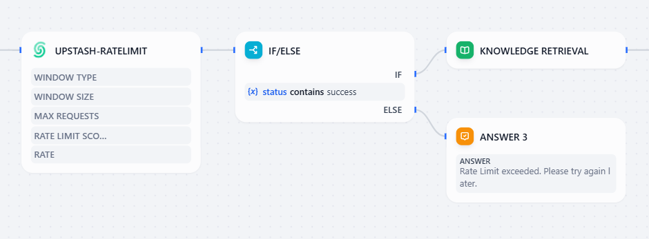
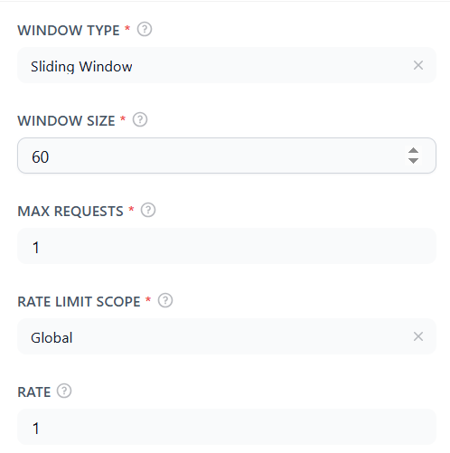

## upstash-ratelimit

**Author:** elifnurdeniz
**Version:** 0.0.1
**Type:** tool

### Description

# Upstash Rate Limit Plugin for Dify

## 🚀 Overview
The **Upstash Rate Limit Plugin** integrates Upstash's Redis-based rate limiting service with the Dify AI platform. This plugin allows developers to enforce request limits within a defined time window using **fixed** or **sliding** window strategies.

## ✨ Benefits
- **Prevents API Exhaustion** – Ensures services are not overwhelmed by excessive requests, protecting system resources.
- **Protects Against Abuse & Misuse** – Limits excessive requests from malicious actors or misconfigured applications.
- **Optimizes Costs** – Prevents unnecessary API usage, reducing server costs for cloud-based applications.
- **Built for Scalability** – Upstash Redis is a serverless database, ensuring the rate limiter scales with flexibility both up and down.

## 🛠️ Features
- **Redis-Based Rate Limiting**: Leverages Upstash Redis for efficient rate limiting.
- **Fixed and Sliding Window Support**: Choose between different rate-limiting strategies.
- **Per User or Global Rate Limiting**: Apply rate limits per user or globally.
- **Customizable Parameters**: Configure window size, max requests, and rate limit scope.

## 🔧 Setup & Configuration

### 1️⃣ **Prerequisites**
- A Dify AI instance running
- An Upstash Redis account ([Sign up here](https://console.upstash.com/))
- A Redis Database ([Create from here](https://console.upstash.com/redis?teamid=0))
- Your Upstash Redis **REST URL** and **REST Token**

### 2️⃣ **Installation**
To install and activate the plugin:
1. Navigate to the **Dify Plugin Store**.
2. Search for **Upstash-Ratelimit**.
3. Click **Install** and follow the setup instructions.

### 3️⃣ **Plugin Configuration**
After installation, you must provide:
- **Upstash Redis REST URL**: The REST API endpoint for your Upstash Redis database.
- **Upstash Redis REST Token**: The API authentication token for your Redis instance.

### 4️⃣ **Usage**
This plugin can be used within a Dify **Chatflow / Workflow / Agent**  to control request limits.
The plugin outputs structured **JSON data**, including key fields that can be used to handle the request.
The **success** or **failure** of a request can be verified using the `status` variable.
You can add an `IF/ELSE` condition in the app:
* If the status contains "success", continue the request.
* If status contains "error", take alternative actions (e.g., return a rate limit exceeded message).




#### 📌 **Available Parameters**
| Parameter        | Type    | Required | Description |
|-----------------|---------|----------|-------------|
| `window type`   | Select  | ✅ Yes   | Defines the rate limit type (`fixed window` or `sliding window`). Learn more [here](https://upstash.com/docs/redis/sdks/ratelimit-py/algorithms). |
| `window size`   | Number  | ✅ Yes   | Time window size in seconds. |
| `max requests`  | Number  | ✅ Yes   | Maximum allowed requests within the window. |
| `rate limit scope` | Select | ✅ Yes  | Applies rate limit rule for all users or per user. |
| `rate`          | Number  | ❌ No   | Number of requests deducted per operation. Defaults to `1`. |

#### ✅ **Example Usage**
A sliding window rate limit that allows 10 requests per minute globally:
```json
{
  "window type": "sliding window",
  "window size": 60,
  "max requests": 10,
  "rate limit scope": "global"
}
```

In console:
<br/>




### Author
Github: [Elifnurdeniz](https://github.com/Elifnurdeniz)
Mail: elif.deniz@std.bogazici.edu.tr
Repo: [Upstash Ratelimit Plugin](https://github.com/Elifnurdeniz/Upstash-Rate-Limiting-Plugin-For-Dify)

